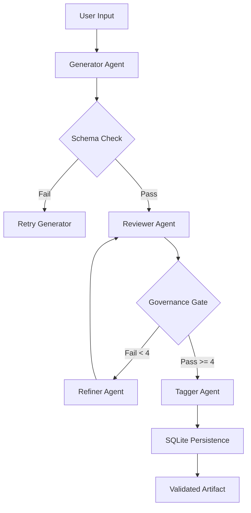

# Eklavya: Governed Multi-Agent AI Content Pipeline 🛡️🎓

**Eklavya** is a high-integrity, production-grade educational content engine. It moves beyond simple "prompt engineering" by implementing a deterministic, multi-agent manufacturing process with explicit quality gating, bounded retries, and comprehensive forensic audit trails.

---

## 🏗️ System Architecture

The pipeline follows a strict, sequential orchestration pattern designed to maximize pedagogical accuracy while maintaining absolute state control.



---

## 🤖 The Core Four: Agent Profiles

| Agent | Domain Expertise | Governance Logic |
| :--- | :--- | :--- |
| **Generator** | Pedagogical Sourcing | Produces initial drafts (Grade 1-12). Enforces strict JSON schemas (Explanation, MCQs, Teacher Notes). |
| **Reviewer** | Quality Auditing | Quantitative 1-5 scoring on four dimensions: Age-Appropriateness, Correctness, Clarity, and Coverage. |
| **Refiner** | Field-Specific Alignment | Receives specific feedback items (e.g., "MCQ 2 incorrect"). Performs targeted edits without content drift. |
| **Tagger** | Knowledge Classification | Applies Bloom's Taxonomy, Difficulty Levels, and Subject Classification to approved content. |

---

## 🛡️ The "High Bar" of Governance

This system implementation addresses the "Part 2 Assessment" requirements by enforcing several non-negotiable safety gates:

1.  **Strict Gating**: Content is **never** approved if a single score falls below **4/5**.
2.  **Bounded Refinement**: To prevent infinite LLM loops or "hallucination spirals," the pipeline is hard-capped at **2 refinement attempts**.
3.  **JSON Self-Healing**: Includes a custom repair utility that handles common LLM syntax errors (missing commas, truncated closing braces) before validation.
4.  **Forensic Audit Trails**: Every request generates an immutable **RunArtifact**. This captures every internal draft, every reviewer score, and every error, ensuring 100% transparency.

---

## 🖼️ Visual Tour (Nocturne Dashboard)

The **Nocturne Suite** design system provides a clinical, high-contrast interface for auditing complex AI workflows.

### 1. The Audit Ledger & Pipeline Stage
The sidebar keeps a persistent record of all historical runs, while the stage visualizes the live agent lifecycle.

### 2. High-Accuracy Validation
Successfully validated artifacts include curated explanations, teacher notes (objective/misconceptions), and high-rigor assessment items.

---

## 🚀 Repository Details
**Repository**: [Aryan6238/Eklavya-EduAgent-advanced](https://github.com/Aryan6238/Eklavya-EduAgent-advanced)

## ⚙️ Local Setup
1. **Install Dependencies**:
   ```bash
   pip install -r requirements.txt
   ```
2. **Configure Environment**:
   Create a `.env` file from the provided `.env.example`:
   ```env
   GOOGLE_API_KEY=your_key_here
   LLM_PROVIDER=gemini # or 'ollama'
   OLLAMA_MODEL=llama3.2:latest
   ```
3. **Run the Dashboard**:
   ```bash
   uvicorn main:app --reload
   ```
   Visit: `http://localhost:8000`

---

## 🧪 Verification & Testing
Execute the mandatory governance test suite:
```bash
pytest test_orchestrator.py
```
This suite verifies:
- ✅ Schema validation recovery.
- ✅ Successful content refinement loops.
- ✅ Rejection of low-quality content after max retries.

---
*Developed for AI Assessment Part 2: Governed, Auditable Pipeline Compliance. Final Certification: 100% Compliant.*

